<picture>
  <source media="(prefers-color-scheme: dark)" srcset="assets/header-dark.svg">
  <source media="(prefers-color-scheme: light)" srcset="assets/header-light.svg">
  
</picture>

# Leandro De Lima Santos

**Analista de Suporte de TI** · Estudante de Análise e Desenvolvimento de Sistemas (conclusão em junho de 2027)

> 🇧🇷 [Português](README.md) · 🇬🇧 [English](README.en.md)

## 🌐 Portfólio

Site com experiência, trilha, tecnologias e próximos passos — em PT/EN, com dark mode:
**[https://1eandr.github.io/portfolio/](https://1eandr.github.io/portfolio/)**

## 📍 Resumo

- Suporte de ponta a ponta em sistemas fiscais (NFe/CTe), de chamados a documentação.
- Automação de rotinas repetitivas com scripts Python — menos erros manuais, mais tempo para o time.
- Estudo autodidata de Python, SQL e desenvolvimento web, aplicado em projetos próprios.

## 🛠 Stack

`Python` · `JavaScript` · `SQL` · `HTML5` · `CSS3` · `Flask` · `Git` · `GitHub` · `APIs REST` · `Automação`

## 🧭 Próximos passos

1. Evoluir na TI — papel mais técnico conectando automação, APIs e desenvolvimento.
2. Pós-graduação em Inteligência Artificial.
3. Certificação formal de inglês.
4. Concluir a graduação em ADS (junho/2027).

## 🗣 Idiomas

**Português** nativo · **Italiano** conversação fluente · **Inglês** autodidata (~C2)

## 📬 Contato

- E-mail: [leandrolima198@hotmail.com](mailto:leandrolima198@hotmail.com)
- GitHub: [@1eandr](https://github.com/1eandr)

---

Feito com React, Vite e React Bits.
